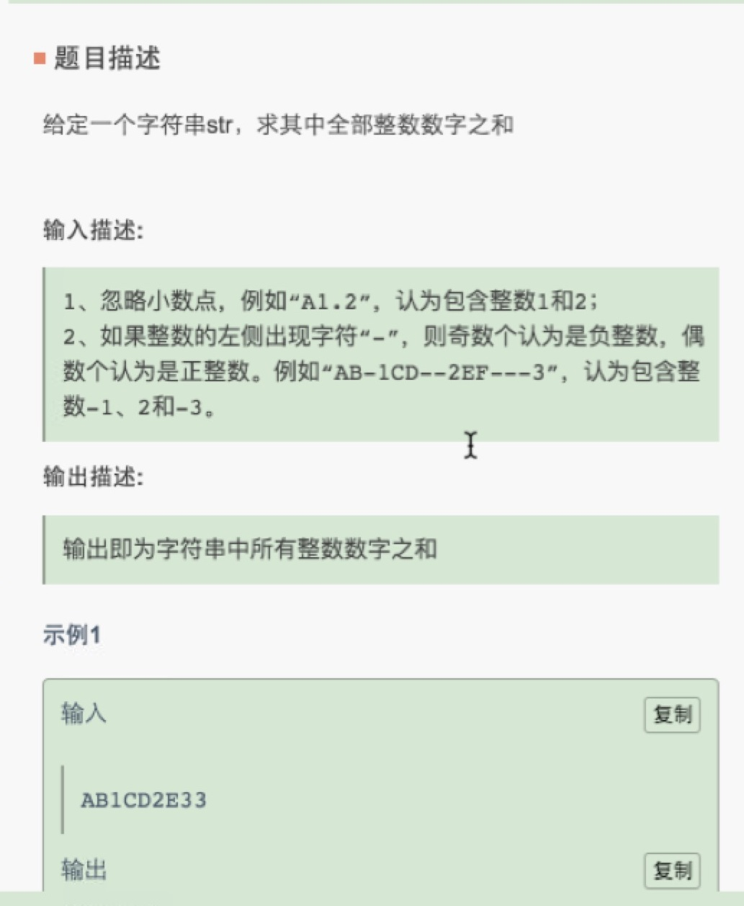
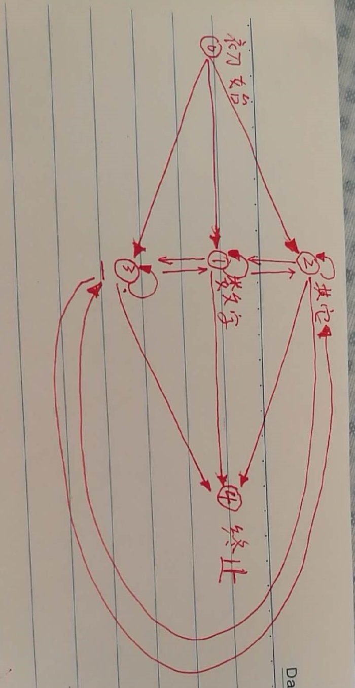

# 校招笔试题

一些校招笔试题的总结

## 华为笔试的第一题



解法，使用有限状态机的思想

相关思路来源:[牛客网](https://www.nowcoder.com/questionTerminal/6f8c901d091949a5837e24bb82a731f2)



```java
    public int getStrSum(String str) {
        if (str == null || str.length() == 0) return 0;
        int res = 0;
        int i = 0;
        int state = 0;
        Stack<Character> stack = new Stack<>();
        boolean sign = false;
        // 有限状态机，总共5种状态，0初始态，1数字，2其他字符，3'-'，4终止态
        lable:
        while (i <= str.length()) {
            if (i >= str.length()) state = 4;
            switch (state) {
                case 0:
                    char c = str.charAt(i);
                    if (Character.isDigit(c)) {
                        state = 1;
                        // 数字入栈
                        if (stack.isEmpty()) {
                            stack.push(c);
                        } else {
                            throw new IllegalStateException("栈应为空！");
                        }
                    } else if (c == '-') {
                        state = 3;
                        sign = true;
                    } else {
                        state = 2;
                    }
                    break;
                case 1:
                    c = str.charAt(i);
                    if (Character.isDigit(c)) {
                        state = 1;
                        stack.push(c);
                    } else if (c == '-') {
                        // 计算之前的结果
                        if (!stack.isEmpty()) {
                            char[] chars = new char[stack.size()];
                            for (int j = chars.length-1; j >= 0; j--) chars[j] = stack.pop();
                            int tmp = Integer.valueOf(new String(chars));
                            if (sign) {
                                res -= tmp;
                            } else {
                                res += tmp;
                            }
                        }
                        state = 3;
                        sign = true;
                    } else {
                        // 计算之前的结果
                        if (!stack.isEmpty()) {
                            char[] chars = new char[stack.size()];
                            for (int j = chars.length-1; j >= 0; j--) chars[j] = stack.pop();
                            int tmp = Integer.valueOf(new String(chars));
                            if (sign) {
                                res -= tmp;
                            } else {
                                res += tmp;
                            }
                        }
                        state = 2;
                    }
                    break;
                case 2:
                    c = str.charAt(i);
                    if (Character.isDigit(c)) {
                        if (stack.isEmpty()) {
                            stack.push(c);
                        } else {
                            throw new IllegalStateException("栈应为空！");
                        }
                        state = 1;
                    } else if (c == '-') {
                        sign = true;
                        state = 3;
                    }
                    break;
                case 3:
                    c = str.charAt(i);
                    if (Character.isDigit(c)) {
                        if (stack.isEmpty()) {
                            stack.push(c);
                        } else {
                            throw new IllegalStateException("栈应为空！");
                        }
                        state = 1;
                    } else if (c == '-') {
                        sign = !sign;
                        state = 3;
                    } else {
                        sign = false; // 符合位无效，重置初始状态
                        state = 2;
                    }
                    break;
                case 4:
                    if (!stack.isEmpty()) {
                        char[] chars = new char[stack.size()];
                        for (int j = chars.length-1; j >= 0; j--) chars[j] = stack.pop();
                        int tmp = Integer.valueOf(new String(chars));
                        if (sign) {
                            res -= tmp;
                        } else {
                            res += tmp;
                        }
                    }
                    break lable;
            }

            i++;
        }

        return res;
    }
```

# 京东关于类加载和初始化的一些题
```java
public class Test {

    public static void main(String[] args) throws Exception {
        //A reference to a static field (§8.3.1.1) causes
        // initialization of only the class or interface
        // that actually declares it, even though it might be
        // referred to through the name of a subclass, a subinterface,
        // or a class that implements an interface.
        // 对一个静态属性的引用仅仅造成实际声明它的类或接口的初始化，即使引用它通过它的子类或接口的名字
        // 因此输出AC，仅仅造成类A的初始化
        System.out.println(B.c);
    }

}

class A {
    public static String c = "C";
    static {
        System.out.print("A");
    }
}

class B extends A {
    static {
        System.out.print("B");
    }
}

```

```java
public class Test {

    public static void main(String[] args) throws Exception {
        // A static field declared by T is used and
        // the field is not a constant variable (§4.12.4).
        // 一个声明在类T中的静态属性被使用，
        // 如果此属性不是常量类型变量，那么造成类的初始化
        // 因此输出JD，这是一个常量静态变量，因此不会造成类Test2的初始化
        System.out.println(Test2.a);
    }

}

class Test2 {
    public static final String a = "JD";

    static {
        System.out.print("OK");
    }
}

```

```java
public class Test {

    public static void main(String[] args) throws Exception {
        // A static field declared by T is used and
        // the field is not a constant variable (§4.12.4).
        // 一个声明在类T中的静态属性被使用，
        // 如果此属性不是常量类型变量，那么造成类的初始化
        // 因此输出OKJD，这是虽然是一个final修饰的静态变量，
        // 但是赋初值不是一个字面值，仍然会造成类的初始化
        System.out.println(Test2.a);
    }

}

class Test2 {
    public static final String a = new String("JD");

    static {
        System.out.print("OK");
    }
}
```

```java
public class Test {

    private static int x = 10;
    private static Integer y = 10;

    public static void updateX(int value) {
        value = 3 * value;
    }

    public static void updateY(Integer value) {
        value = 3 * value;
    }

    public static void main(String[] args) throws Exception {
        updateX(x);
        updateY(y);
        // 执行后x，y的值不变
        // 首先对于x，基本类型在java中是传值的,因此只是将x的值赋给了value
        // 而对于y，传的是引用，但是只是让value指向了和y一样的对象，紧接着
        // 函数内部就将value的引用改为了新的生成的Integer对象了，因此y的引用不变
    }

}


```
