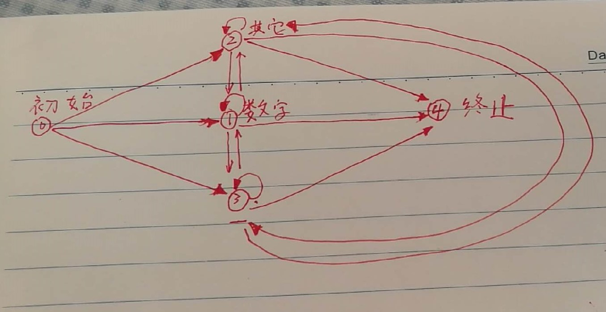

# 校招笔试题

一些校招笔试题的总结

## 华为笔试的第一题


解法，使用有限状态机的思想

相关思路来源:[牛客网](https://www.nowcoder.com/questionTerminal/6f8c901d091949a5837e24bb82a731f2)



```java
    public int getStrSum(String str) {
        if (str == null || str.length() == 0) return 0;
        int res = 0;
        int i = 0;
        int state = 0;
        Stack<Character> stack = new Stack<>();
        boolean sign = false;
        // 有限状态机，总共5种状态，0初始态，1数字，2其他字符，3'-'，4终止态
        lable:
        while (i <= str.length()) {
            if (i >= str.length()) state = 4;
            switch (state) {
                case 0:
                    char c = str.charAt(i);
                    if (Character.isDigit(c)) {
                        state = 1;
                        // 数字入栈
                        if (stack.isEmpty()) {
                            stack.push(c);
                        } else {
                            throw new IllegalStateException("栈应为空！");
                        }
                    } else if (c == '-') {
                        state = 3;
                        sign = true;
                    } else {
                        state = 2;
                    }
                    break;
                case 1:
                    c = str.charAt(i);
                    if (Character.isDigit(c)) {
                        state = 1;
                        stack.push(c);
                    } else if (c == '-') {
                        // 计算之前的结果
                        if (!stack.isEmpty()) {
                            char[] chars = new char[stack.size()];
                            for (int j = chars.length-1; j >= 0; j--) chars[j] = stack.pop();
                            int tmp = Integer.valueOf(new String(chars));
                            if (sign) {
                                res -= tmp;
                            } else {
                                res += tmp;
                            }
                        }
                        state = 3;
                        sign = true;
                    } else {
                        // 计算之前的结果
                        if (!stack.isEmpty()) {
                            char[] chars = new char[stack.size()];
                            for (int j = chars.length-1; j >= 0; j--) chars[j] = stack.pop();
                            int tmp = Integer.valueOf(new String(chars));
                            if (sign) {
                                res -= tmp;
                            } else {
                                res += tmp;
                            }
                        }
                        state = 2;
                    }
                    break;
                case 2:
                    c = str.charAt(i);
                    if (Character.isDigit(c)) {
                        if (stack.isEmpty()) {
                            stack.push(c);
                        } else {
                            throw new IllegalStateException("栈应为空！");
                        }
                        state = 1;
                    } else if (c == '-') {
                        sign = true;
                        state = 3;
                    }
                    break;
                case 3:
                    c = str.charAt(i);
                    if (Character.isDigit(c)) {
                        if (stack.isEmpty()) {
                            stack.push(c);
                        } else {
                            throw new IllegalStateException("栈应为空！");
                        }
                        state = 1;
                    } else if (c == '-') {
                        sign = !sign;
                        state = 3;
                    } else {
                        sign = false; // 符合位无效，重置初始状态
                        state = 2;
                    }
                    break;
                case 4:
                    if (!stack.isEmpty()) {
                        char[] chars = new char[stack.size()];
                        for (int j = chars.length-1; j >= 0; j--) chars[j] = stack.pop();
                        int tmp = Integer.valueOf(new String(chars));
                        if (sign) {
                            res -= tmp;
                        } else {
                            res += tmp;
                        }
                    }
                    break lable;
            }

            i++;
        }

        return res;
    }
```
